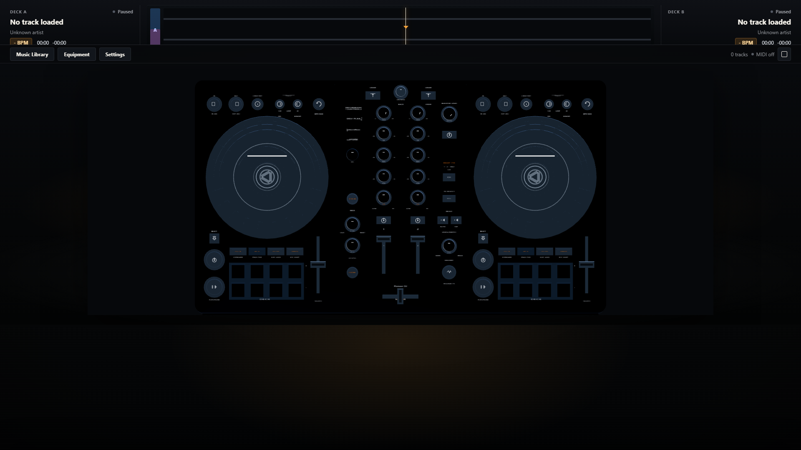

# DDJ-FLX4 Web DJ Player

A browser-based reconstruction of a DDJ-FLX4-style DJ controller — interactive
3D hardware, a real Web Audio engine underneath, and a fully semantic control
layer that decouples input, audio, and visuals.



---

## What is this?

This is not a Three.js demo of a DJ controller. It is a working two-deck DJ
workstation in the browser, with the controller rendered as a raycast-driven
3D model that dispatches the same semantic actions as the debug UI and a Web
MIDI adapter.

The 3D model is a controller, not the engine.

```
        Pointer (3D raycast)   Pointer (debug UI)    Web MIDI
                  │                    │                  │
                  └────────────────────┼──────────────────┘
                                       ▼
                                  DJEngine
                          (single source of truth)
                                       │
            ┌──────────────────────────┼──────────────────────────┐
            ▼                          ▼                          ▼
       DeckEngine             Mixer / Effects / FX           Analysis
            │                          │                          │
            └──────────────────────────┼──────────────────────────┘
                                       ▼
                                 Web Audio API
```

A single `AudioContext` owns the audio graph. UI state is a shallow,
serialisable JSON snapshot published by `DJEngine`. The 3D scene never
manipulates audio nodes and never holds `AudioBuffer` / `AudioContext` /
`AudioNode` in React state — that boundary is enforced by the engine and
verified by the test suite.

---

## Why

Could a recognizable hardware DJ workflow be reconstructed in the browser
while keeping the controller, audio engine, analysis pipeline, and input
system cleanly separated? That question is the project.

Building it required real work in:

- Web Audio graph design and source-node lifecycle management
- DSP — scratch, EQ, beat-synced effects, smart fader automation
- Music analysis — energy-envelope onset detection, BPM estimation, beatgrid
  generation
- Real-time state synchronization from engine to 3D visuals with
  feedback-loop suppression
- Interaction design — pointer-to-angular-delta normalization, platter vs.
  rim hit zones, soft-takeover for controllers
- 3D rendering with a high-poly GLB and 77 named controls
- Browser performance on a constrained single-page app

---

## Features

All features below are wired to the engine and covered by automated tests
unless otherwise noted.

### Dual-deck transport

- Local audio file load (decode → cached `AudioBuffer`, never serialized)
- Play / pause
- Cue: pause-and-set, back-cue, return-to-start
- Seek with rate-aware position
- Tempo slider with multiple ranges
- Nudge (±2% temporary rate)
- Track load, reload, and clear

### Mixer

- Trim per channel
- 3-band EQ (high / mid / low) per channel, with 0 dB at the visual center
- Sound Color FX (LP/HPF) per channel, plus Smart CFX macro
- Channel faders, crossfader with equal-power center detent
- Master level
- Channel level metering

### Jog wheels and scratch

- Interactive jog with **platter vs. rim** hit zones
- Rim → nudge; platter → scratch
- Scratch lifecycle: normal-source pause, scratch preview source, resume
- Velocity-driven scratch playback rate (0.3×–2.0×)
- Backward scratch: position updates correctly; preview is forward snippets
  (true reverse needs AudioWorklet/WASM, planned)
- Dead zones for jitter and source churn
- Playback-driven jog wheel rotation when not being touched
- Deck A and Deck B are fully isolated

### Beat and performance

- BPM estimation (energy-envelope onset detection + octave folding to
  70–180 BPM, confidence scoring)
- Beatgrid generation from BPM + anchor
- Manual BPM override with rebuild from manual
- Beat Sync: master/slave assignment, one-time phase alignment, manual
  tempo takeover, master tempo change auto-updates slave
- Beat loops: IN, OUT, 4-beat auto, halve, double, exit
- Beat Jump: ±1/2/4/8 beats, grid-aligned, loop-shift aware
- Performance pads with modes: Hot Cue, Beat Loop, Beat Jump, Sampler
- 8 hot cue slots per deck, color-coded markers on the waveform
- Sampler: 8 global slots, dedicated bus, independent from deck transport

### Effects

- Beat FX (Web Audio approximations): Echo, Delay, Reverb, Flanger, Filter
- Target select: A, B, or master
- Beat multiplier 1/16..8 with BPM-locked timing
- Level/depth mix
- Release FX: Echo Out
- Smart CFX (per-channel macro knob, center = neutral)
- Smart Fader (crossfader-driven EQ automation)

These are Web Audio approximations. They are not DSP-accurate emulations of
the Pioneer/rekordbox effect chain.

### Waveforms

- High-DPI Canvas rendering
- Overview waveform (full track, playhead marker, click-to-seek)
- Scrolling detailed waveform
- Beat markers (every-4th-grid)
- Loop overlays
- Hot-cue markers
- Independent Deck A / Deck B state

### Library

- Local file import (single or multi-file)
- Search by title / artist / filename (case-insensitive)
- Sort by title, artist, BPM, duration, added, last played
- Filter by analysis status (all / analyzed / analyzing / failed)
- Duplicate detection (same name + size + lastModified)
- Per-row LOAD A / LOAD B buttons
- Recently played tracking
- Browse encoder drives library selection

The library is currently in-memory. There is no IndexedDB persistence yet.

### 3D controller

- Detailed GLB model with 77 named interactive controls
- Deterministic rest pose
- Raycast-based hit testing through a manifest of semantic control IDs
- Knobs, faders, buttons, pads, jog platter/rim, browse encoder
- Engine → 3D state sync with feedback-loop suppression
- 3D → engine semantic actions through a data-driven binding table
- LED feedback on caps (PLAY, CUE, SYNC, LOOP IN/OUT, pad modes, FX ON/OFF,
  Smart controls)
- Adjustable themes (default dark, glossy black, accent neon)
- Sticker customization (HTML/CSS overlay):
  - Add, drag, scale, rotate, change gloss, change finish
  - Drag-time perspective tilt (2.5D feel)
  - Sticker placement is a screen-space overlay over the controller
    — not a projected decal on the GLB

### MIDI

- Web MIDI API integration (`MidiManager`): feature detection, permission,
  device discovery, hot-plug, learn mode, bounded monitor
- `MidiParser`: Note On/Off, CC, Pitch Bend
- `MidiMapper`: data-driven routing, normalization (midi7/midi14/bipolar/
  centered), relative encoders (two's complement + binary offset), soft
  takeover, button debounce, mapping validation
- DDJ-FLX4 mapping configuration file present
- All FLX4 mappings currently marked **UNVERIFIED** — no physical controller
  was available during development. Use MIDI Learn/Monitor to capture real
  values before relying on plug-and-play hardware support.

---

## Architecture

```
                    Input Adapters
        ┌──────────────┼──────────────┐
        │              │              │
     3D UI          Debug UI       Web MIDI
        │              │              │
        └──────────────┼──────────────┘
                       ▼
                    DJEngine
        (source of truth — serialisable state)
                       ▼
       ┌───────────────┼────────────────┐
       │               │                │
   DeckEngine     Mixer / FX       Analysis
       │               │                │
       └───────────────┼────────────────┘
                       ▼
                 Web Audio API
                       ▼
                Audio Destination
```

Key rules:

- The 3D scene never manipulates audio nodes. All audio side effects go
  through `DJEngine.dispatch(action)`.
- React state holds serialisable engine snapshots — never `AudioBuffer`,
  `AudioNode`, or `AudioContext`.
- The 3D layer only emits semantic actions (`JOG_PLATTER_MOVE`,
  `SET_EQ_HIGH`, `PAD_DOWN`, …) keyed by control ID. The same semantic
  actions are emitted by the debug UI and the MIDI adapter.
- State sync from engine → 3D visuals uses feedback-loop suppression so
  programmatic visual updates do not trigger new actions.

See [`docs/ARCHITECTURE.md`](docs/ARCHITECTURE.md) for the full design.

---

## Audio pipeline

Per-deck signal flow:

```
AudioBufferSourceNode
        ▼
   AnalyserNode (pre-fader metering)
        ▼
   Trim → EQ Low → EQ Mid → EQ High
        ▼
   CFX (LPF) → CFX (HPF)
        ▼
   Channel Fader → Crossfade Gain → Master
        ▼
   Audio Destination
```

- Normal playback and scratch share the same chain. The source node is
  swapped depending on transport mode — never both active at once.
- `AudioBufferSourceNode` is single-use: a fresh source is created on play,
  seek, tempo change, nudge, and after scratch.
- All gain changes use `linearRampToValueAtTime` over ~20 ms to avoid
  clicks.
- The sampler has its own bus and gain, independent of the deck channels.

See [`docs/AUDIO_ENGINE.md`](docs/AUDIO_ENGINE.md) for details.

---

## Tech stack

| Layer | Choice |
|---|---|
| UI | React 18 + TypeScript |
| Build / dev server | Vite 5 |
| Styling | Plain CSS + Tailwind-style utility classes via `index.css` |
| 3D | Three.js + `troika-three-text` for HUD text |
| Audio | Web Audio API |
| Hardware input | Web MIDI API |
| Testing | Vitest + Testing Library + jsdom |
| Linting | ESLint (typescript-eslint, react-hooks, react-refresh) |
| Type checking | `tsc --noEmit` |

---

## Getting started

Requirements: Node.js (Vite 5 requires Node 18+; Node 20 LTS recommended).

```bash
git clone <this-repo>
cd <this-repo>
npm install
npm run dev
```

`npm run dev` prints the Vite URL (typically `http://localhost:5173`).
Open it in a Chromium-based browser for full Web Audio + Web MIDI support.

Other scripts:

```bash
npm run typecheck   # tsc --noEmit
npm run lint        # ESLint
npm test            # Vitest, one run
npm run test:watch  # Vitest, watch mode
npm run build       # typecheck + production bundle
npm run preview     # serve the production build
```

`npm run dev` and `npm run build` first run `scripts/sync-controller-model.mjs`
to keep the public GLB in sync with the source GLB.

---

## Using the app

1. Open the **Music Library** panel.
2. Click **Import** and select one or more local audio files.
3. Use **LOAD A** / **LOAD B** on a row to send a track to each deck.
4. Use the 3D controller (or the on-screen debug UI) to play, cue, mix, and
   apply FX.
5. Try pads: **HOT CUE**, **BEAT JUMP**, **SAMPLER** modes.
6. Press the **SMART FADER** button and move the crossfader to hear the
   EQ automation.
7. Open **Settings / Equipment** to switch themes or add stickers.

The browser may require an initial user gesture (click) before the
`AudioContext` resumes.

---

## Current validation status

**Automated — passing**

- `npm run typecheck` — clean
- `npm run lint` — 0 errors (3 pre-existing unused-constant warnings in
  `surfaceLabelConfig.ts`)
- `npm test` — **574 tests across 25 files, all passing**
- `npm run build` — succeeds

**Browser-verified (manually exercised in development)**

- Transport: play, pause, cue, seek, tempo, nudge
- Mixer: trim, EQ, CFX, channel faders, crossfader, master, metering
- Effects: Beat FX select / beat / target / depth / on-off, Release FX,
  Smart CFX, Smart Fader
- Loops: IN, OUT, 4-beat, halve, double, exit, loop overlay on waveform
- Beat Sync: master/slave, phase alignment, manual takeover
- Beat Jump: ±1/2/4/8 beats, boundary clamping
- Performance pads: Hot Cue, Beat Loop, Beat Jump, Sampler
- Waveforms: overview, detailed, beat markers, hot-cue markers, loop
  overlay
- Library: import, search, sort, filter, LOAD A/B, duplicate detection
- 3D controller: full control binding, LED sync, jog platter/rim,
  feedback-loop suppression
- Themes: all three
- Sticker customization: add, drag, scale, rotate, gloss, finish

**Pending human / physical validation**

- Audible output has not been evaluated by professional DJs against
  reference material on real studio monitors.
- Physical DDJ-FLX4 MIDI mappings are **UNVERIFIED** — every mapping is
  currently a placeholder pending capture from real hardware.
- Specific controls are intentionally no-op or limited:
  - **Pad FX 1 mode** is NOT_IMPLEMENTED (no engine behavior).
  - **Channel cue 1/2, master cue, headphones mix/level** are UNBOUND
    (no headphone monitor state in the engine).
  - **Mic level** is UNBOUND (no microphone input path).
  - **Loop call < / >** in deck section are bound (halve / double loop)
    but should be browser-verified.
  - **Browse encoder** is wired through `LibraryBridge` but needs live
    library-scroll acceptance.

See [`docs/CONTROL_MATRIX.md`](docs/CONTROL_MATRIX.md) for the authoritative
classification of every visible 3D control.

---

## Known limitations

- **Audio**
  - No key lock: tempo changes affect pitch.
  - No continuous phase-lock PLL.
  - Backward scratch uses short forward preview snippets (true reverse
    needs AudioWorklet / WASM).
  - No inertia / backspin simulation.
  - Effects are Web Audio approximations, not Pioneer/rekordbox DSP
    emulations.
  - BPM/beatgrid is heuristic — octave folding can pick the wrong octave
    on signals with weak onset structure.
- **MIDI**
  - All DDJ-FLX4 mappings UNVERIFIED pending real-device capture.
  - No second `AudioContext`; MIDI uses the engine action layer.
- **Library**
  - In-memory only — no IndexedDB persistence yet.
  - No ID3 tag parsing.
  - No folder import, drag-and-drop loading, or File System Access API.
- **3D controller**
  - 168 labels are pure geometry meshes, not texture maps — readability is
    bounded by mesh resolution, anti-aliasing, and viewing angle.
  - Sticker customization is a screen-space DOM/CSS overlay (with
    perspective tilt while dragging), not a projected decal on the GLB.
  - Surface-label sizing has been calibrated against reference imagery
    but visual readability awaits final human acceptance.
- **Mixer**
  - No headphone cue bus, no microphone path.
  - Smart Fader uses a single preset.

---

## Help test it

The current build is about to be handed to several real DJs for hands-on
testing. If you are testing this build, the things that matter most:

- Transport feel (play, pause, cue, seek)
- Cue behavior (set / call / back-cue / return-to-start)
- Jog response (rim nudge vs. platter scratch)
- Scratch behavior (forward clarity, backward handling, end-of-scratch
  resume)
- Tempo response (slider feel, range switching)
- Beat Sync and phase alignment
- Loop workflow (IN/OUT/4-beat, halve/double, loop overlay visibility)
- Pad workflow (Hot Cue save/trigger/delete, Beat Loop, Beat Jump,
  Sampler trigger)
- Mixer feel (trim, EQ center detent, CFX, channel faders, crossfader
  center detent, master)
- FX usability (Beat FX selection, beat multiplier, level/depth)
- Smart Fader / Smart CFX behavior during a transition
- Visual clarity at standard studio sizes (1920×1080, 1728×900, 1366×768)
- Controller labeling — readability and accuracy against the physical
  DDJ-FLX4 you are used to
- Workflow differences from real hardware — anything that surprises you

Please see [`docs/PRO_TEST_GUIDE.md`](docs/PRO_TEST_GUIDE.md) for the
structured acceptance checklist.

---

## Documentation

- [`docs/ARCHITECTURE.md`](docs/ARCHITECTURE.md) — overall architecture
- [`docs/AUDIO_ENGINE.md`](docs/AUDIO_ENGINE.md) — Web Audio graph and
  source-node lifecycle
- [`docs/CONTROL_MATRIX.md`](docs/CONTROL_MATRIX.md) — every visible 3D
  control classified (verified / unbound / not implemented)
- [`docs/MILESTONES.md`](docs/MILESTONES.md) — milestone scope gating
- [`docs/PRO_TEST_GUIDE.md`](docs/PRO_TEST_GUIDE.md) — professional
  acceptance test guide
- [`docs/3d/INTEGRATION.md`](docs/3d/INTEGRATION.md) — 3D controller
  runtime / binding / scale
- [`docs/3d/M12A_REPORT.md`](docs/3d/M12A_REPORT.md),
  [`docs/3d/M12B_REPORT.md`](docs/3d/M12B_REPORT.md) — 3D hierarchy audit
  and engine-binding reports
- [`docs/FINAL_TEXT_PASS_COMPLETE.md`](docs/FINAL_TEXT_PASS_COMPLETE.md) —
  controller text-readability work

---

## Project status

- Core browser DJ engine: implemented
- Mixer DSP: implemented
- Transport, cue, tempo, nudge: implemented
- Jog wheel interaction + scratch: implemented
- Waveforms, BPM, beatgrid: implemented
- Beat Sync, loops, Beat Jump: implemented
- Hot cues, performance pads, sampler: implemented
- Beat FX, Release FX, Smart CFX, Smart Fader: implemented
- Library + application UX: implemented
- 3D controller integration: implemented (M12A hierarchy audit, M12B
  binding + state sync)
- Web MIDI + DDJ-FLX4 mapping file: layer complete, mappings UNVERIFIED
- **Professional DJ acceptance testing: NEXT**
- **Physical DDJ-FLX4 MIDI validation: PENDING**
- **Audible output verification on real monitors: PENDING**
- Advanced scratch (AudioWorklet / WASM): future
- AI DJ coach: future
- Persistent library: future

---

## Roadmap

- Collect professional DJ feedback from real hands-on sessions
- Calibrate and verify physical DDJ-FLX4 MIDI mappings via Web MIDI Learn
- Verify audible output against reference material on studio monitors
- Advanced scratch — AudioWorklet / WASM granular DSP, true reverse,
  inertia / backspin
- Better key / harmonic analysis
- Persistent library (IndexedDB)
- True projected sticker decals on the GLB
- AudioWorklet / WASM time-stretch / key-lock
- Performance work and code-splitting for larger libraries

---

## Disclaimer

This is an independent experimental project. It is inspired by the Pioneer
DDJ-FLX4 controller and by browser-based DJ workflows. It is not affiliated
with, endorsed by, or sponsored by AlphaTheta / Pioneer DJ, rekordbox,
Serato, or Tribe XR. All trademarks belong to their respective owners.